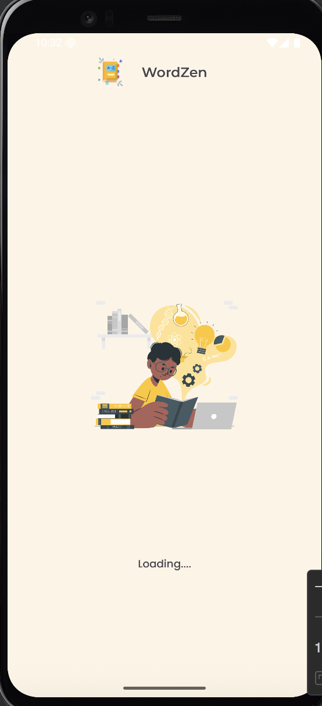
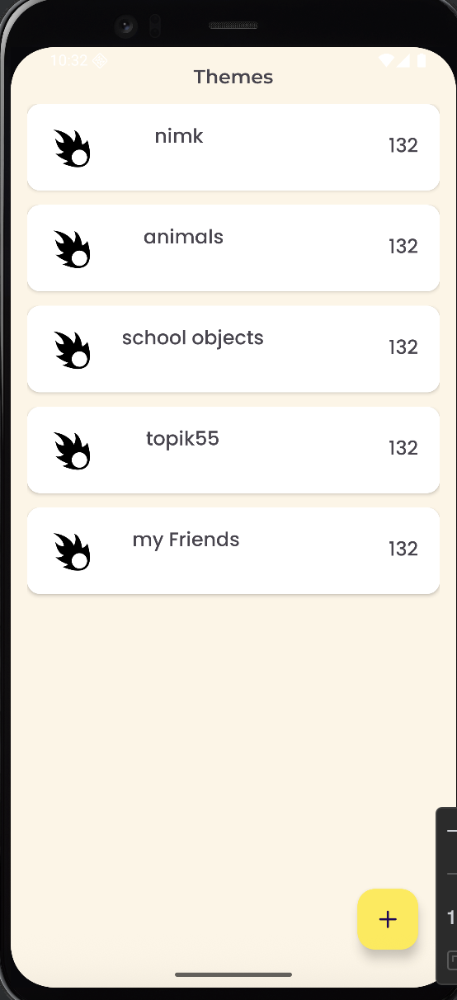
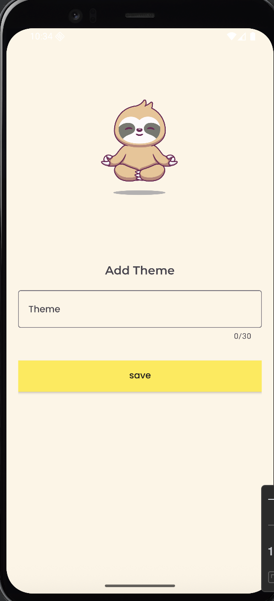
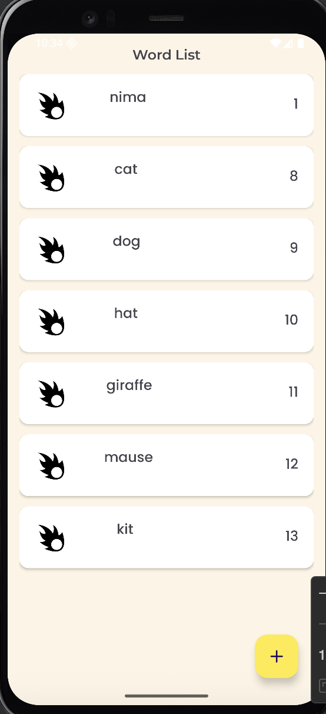
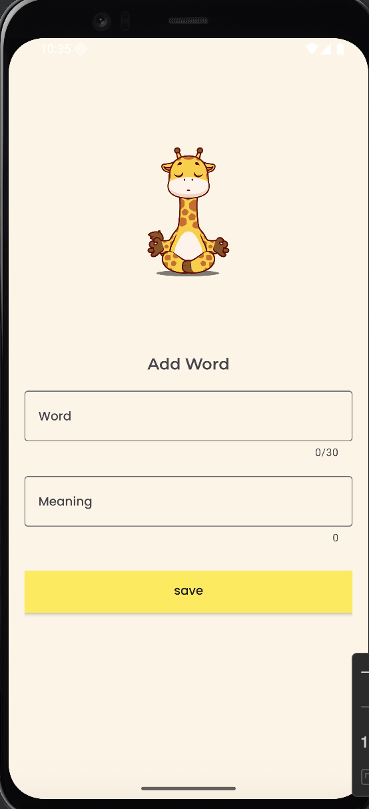
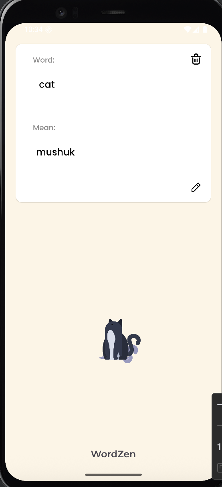

# WordTheme

**WordTheme** is an Android application that helps users organize words by themes. It is ideal for learning vocabulary, creating personal dictionaries, or educational purposes.

## Features

- Organize words into different **themes** (e.g., Animals, Fruits, Sports)
- View all words under a selected theme
- Add, edit, and delete words
- User-friendly interface with **RecyclerView**
- Local data persistence using **Room Database**

## Screenshots
<p float="left">
  
  
  
  
  
  
</p>

## Technologies Used

- **Kotlin** – main programming language
- **Room Database** – for local storage
- **RecyclerView & Adapter** – for displaying lists
- **ViewBinding** – for easier UI handling
- **Material Design Components** – for modern UI

## Installation

1. Clone this repository:
```bash
git clone https://github.com/yourusername/WordTheme.git
